# TRABAJO CONSOLIDADO – SEMANAS 1 A 4

## DISEÑO E IMPLEMENTACIÓN DE BASE DE DATOS EN MÚLTIPLES MOTORES

------------------------------------------------------------------------

## Presentación

El presente documento tiene como objetivo mostrar el diseño y la implementación de la base de datos correspondiente al proyecto asignado, utilizando diferentes sistemas de gestión de bases de datos.

En este trabajo se desarrolla el modelo entidad–relación (DER) y su respectiva representación en distintos entornos, permitiendo evidenciar la estructura lógica y física de la base de datos en motores como MySQL, PostgreSQL, SQL Server y Oracle.

Asimismo, se presentan capturas del proceso de creación de tablas y visualización de la información desde los editores propios de cada motor, con el fin de validar el correcto funcionamiento y la integridad del modelo implementado.

------------------------------------------------------------------------

# 1. DIAGRAMA ENTIDAD–RELACIÓN (DER) – MySQL

## MySQL – Workbench

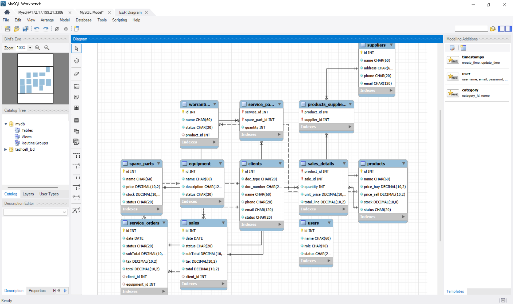

## MySQL – DBeaver

## MySQL – Editor del propio motor

### 🔹 Vista 1 – Tablas completas del modelo

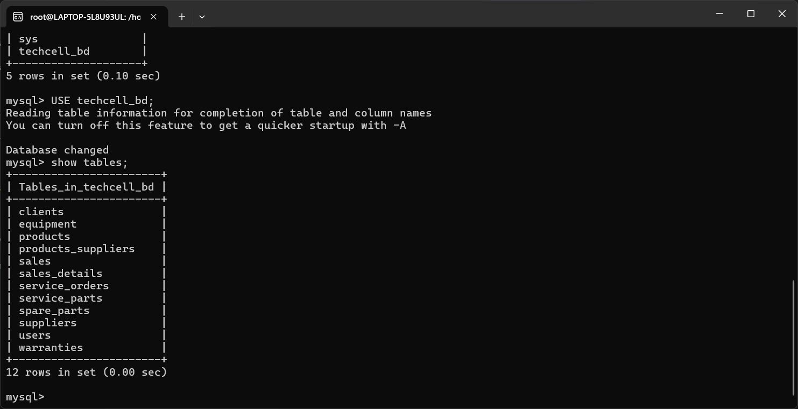

### 🔹 Vista 2 – Estructura de tablas (DESCRIBE)

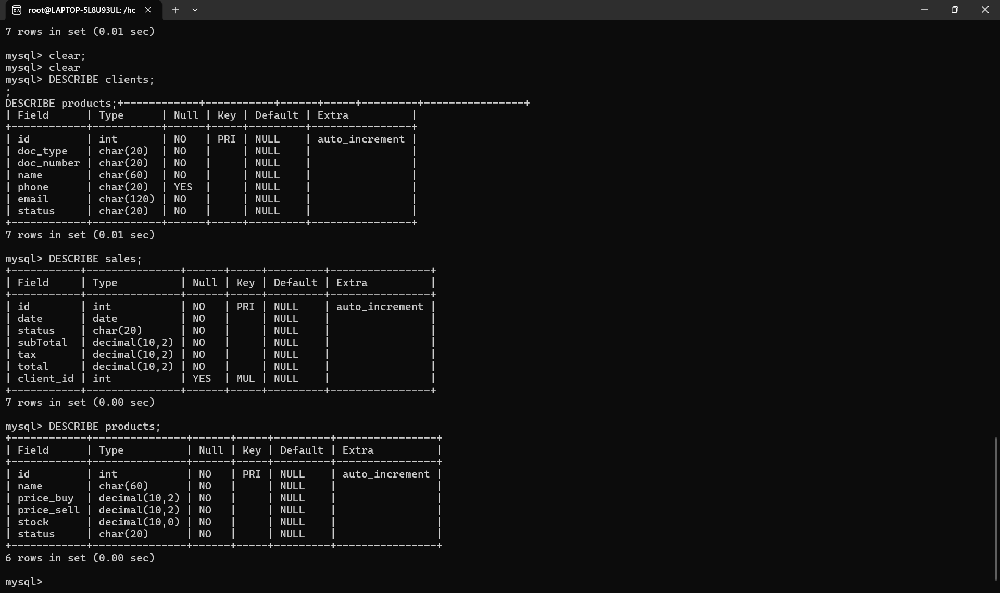

### 🔹 Vista 3 – Verificación de tablas (SHOW TABLES)

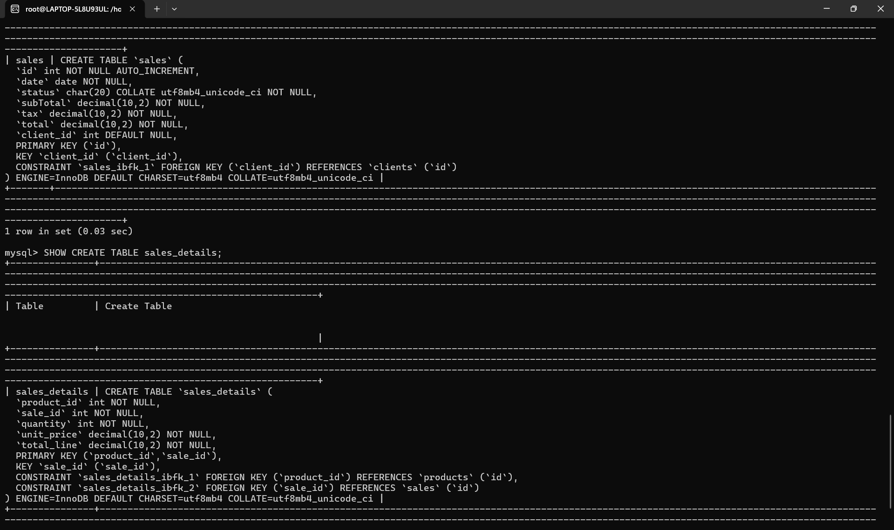

------------------------------------------------------------------------

# 2. DIAGRAMA ENTIDAD–RELACIÓN (DER) – PostgreSQL

## PostgreSQL – DBeaver

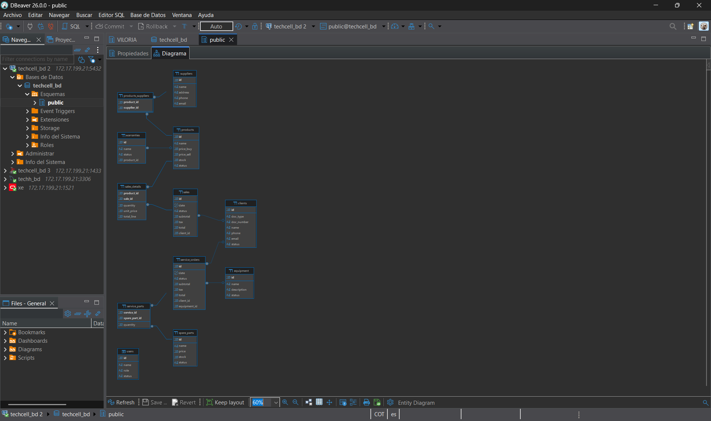

## PostgreSQL – pgAdmin 4

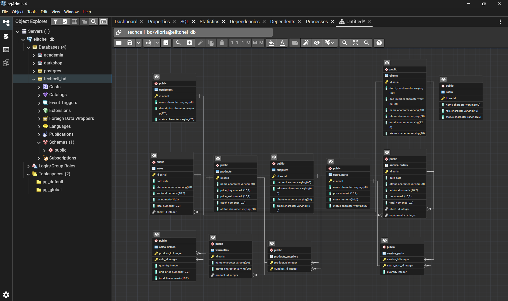

## PostgreSQL – Editor del propio motor

### 🔹 Vista 1 – Base de datos creada

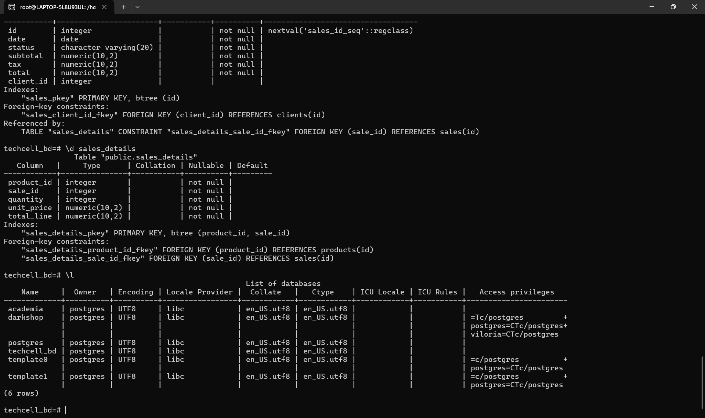

### 🔹 Vista 2 – Tablas de la base de datos

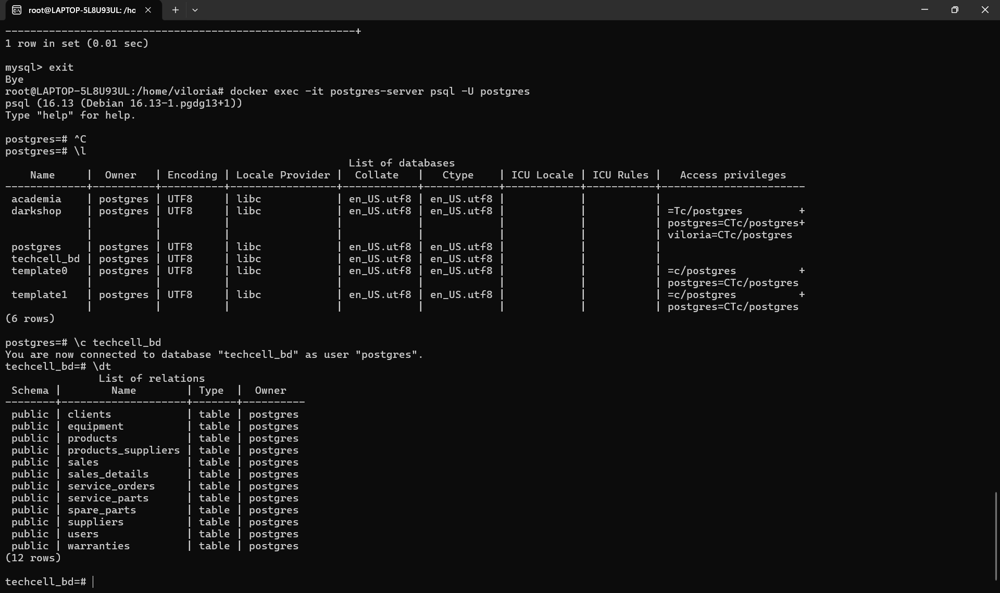

### 🔹 Vista 3 – Consulta de la tabla SALE

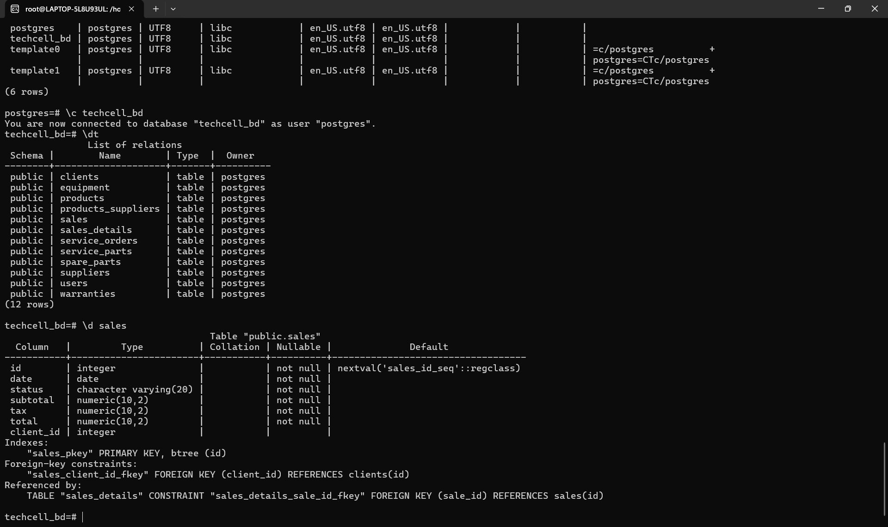

### 🔹 Vista 4 – Consulta de la tabla SALES_DETAILS

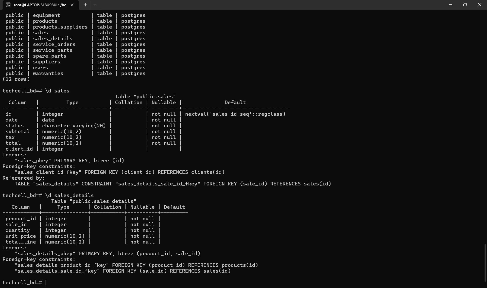

------------------------------------------------------------------------

# 3. DIAGRAMA ENTIDAD–RELACIÓN (DER) – SQL Server

## SQL Server – DBeaver

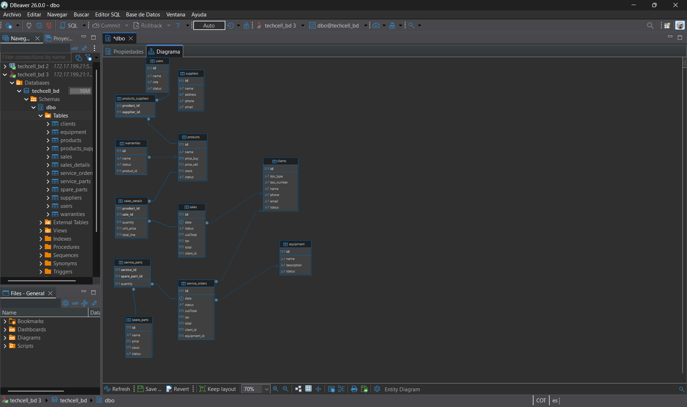

## SQL Server – SQL Server Management Studio (SSMS)

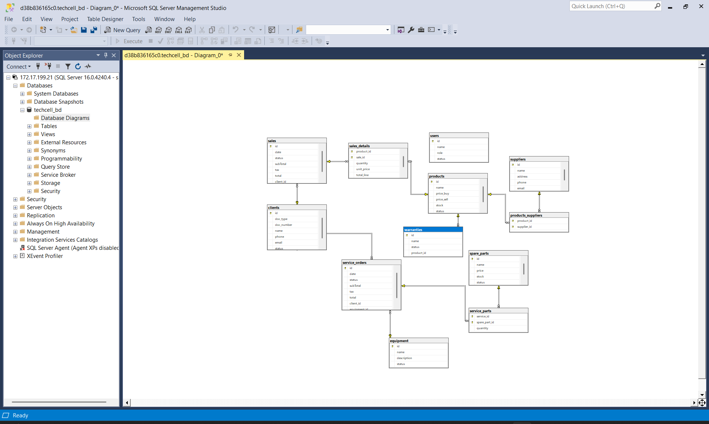

------------------------------------------------------------------------

# 4. DIAGRAMA ENTIDAD–RELACIÓN (DER) – Oracle

## Oracle – DBeaver

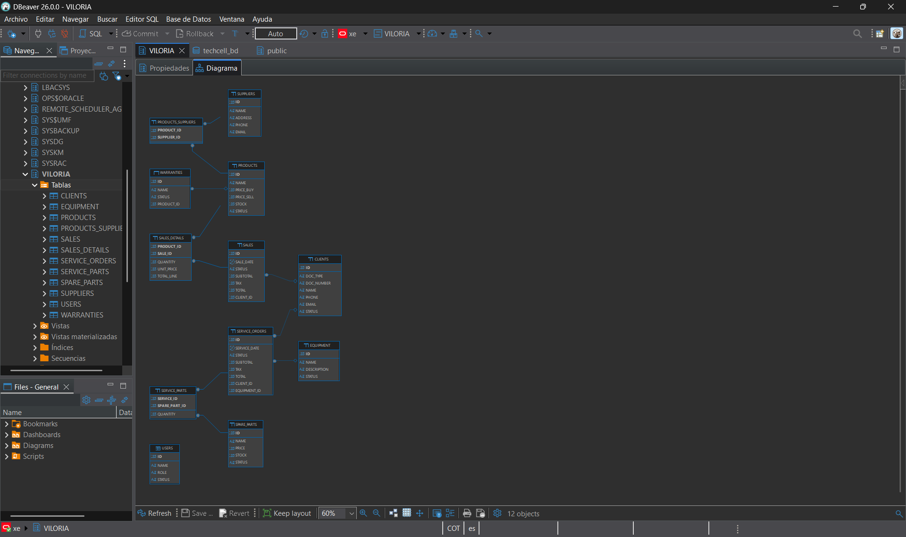

## Oracle – SQL Developer (Motor propio)

### 🔹 Vista 1 – Estructura de la base de datos

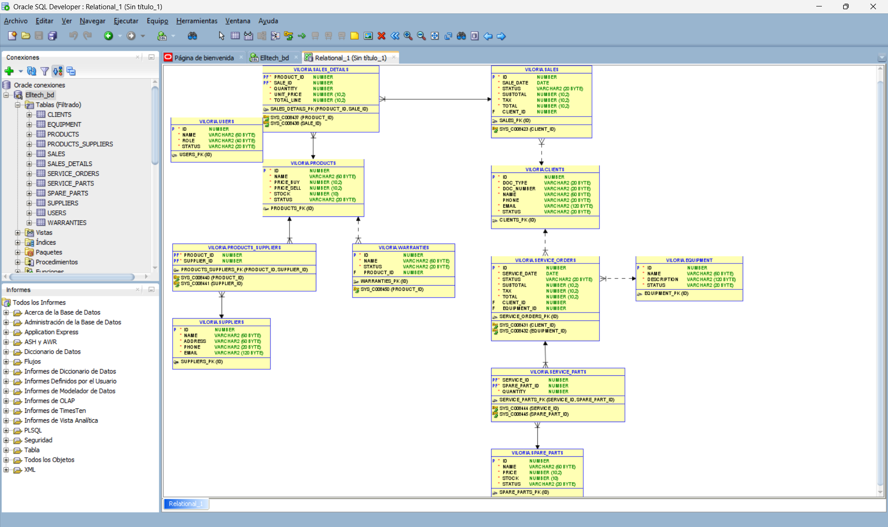

### 🔹 Vista 2 – Tablas creadas en el motor

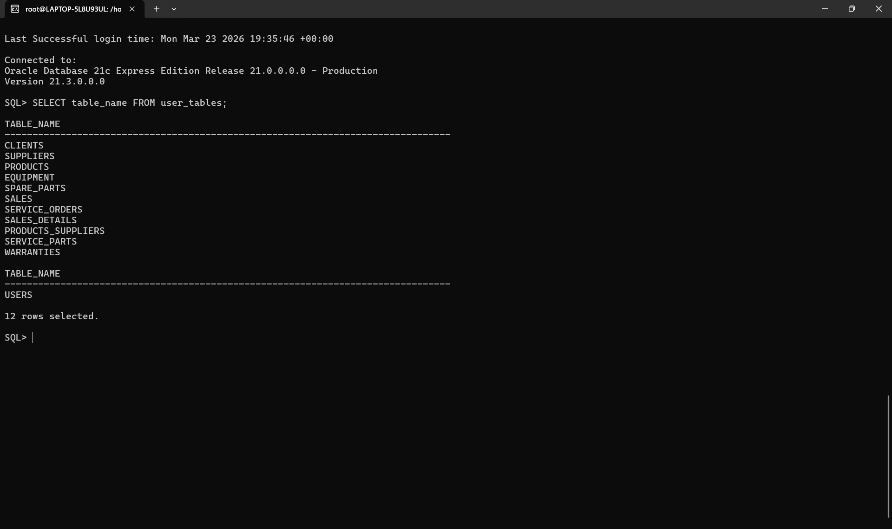

### 🔹 Vista 3 – Descripción de la estructura (DESCRIBE)

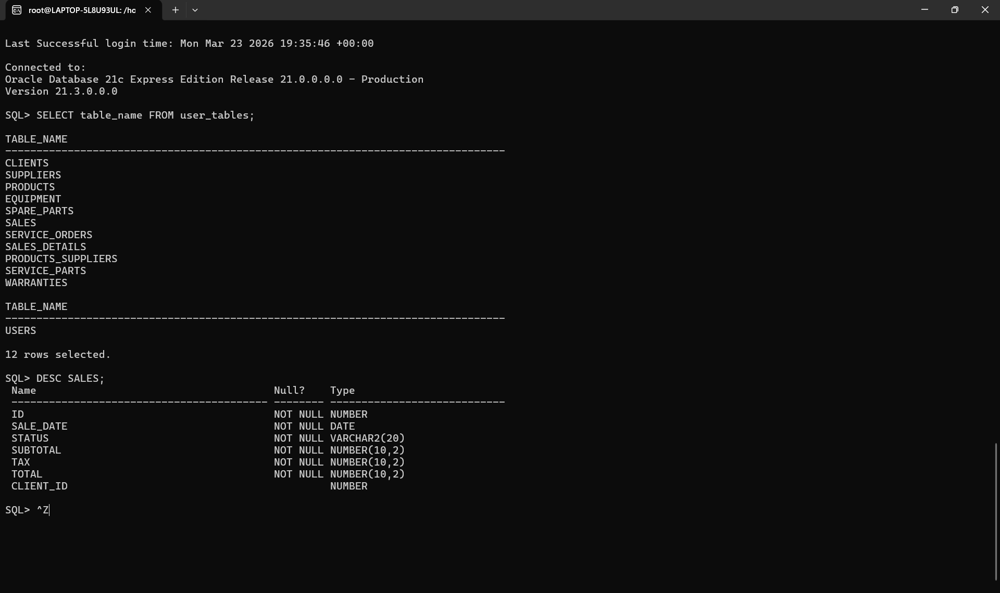

### 🔹 Vista 4 – Segunda descripción de la estructura

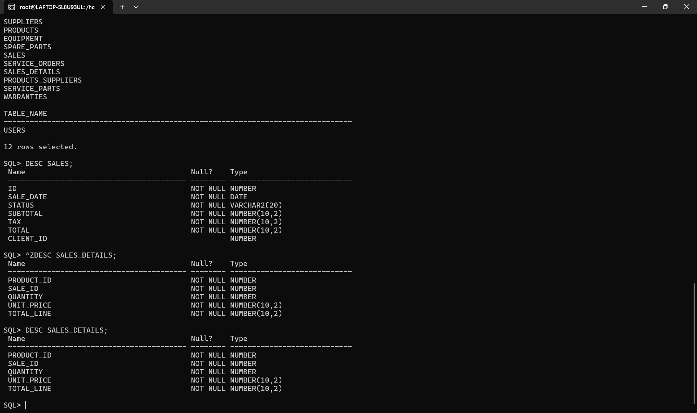

### 🔹 Vista 5 – Relaciones (FOREIGN KEY)

### 🔹 Vista 6 – Relaciones (FOREIGN KEY – continuación)

### 🔹 Vista 7 – Relaciones (FOREIGN KEY – adicional)

# 2. Creación de base de datos en motores

## MySQL - Editor del Motor

### 🔹 Verificación del motor MySQL en ejecución

A continuación se valida que el contenedor correspondiente al motor MySQL se encuentra activo.\
La salida del comando confirma que el servicio `mysql:8.0` está en estado *Up*, lo que indica que el motor está disponible para la creación y gestión de la base de datos del proyecto.

### 🔹 Acceso al motor MySQL desde la terminal

Una vez verificado que el contenedor de MySQL se encuentra en ejecución, se procede a acceder directamente al motor desde la terminal.\
Este paso permite interactuar con MySQL para la creación de la base de datos, la ejecución de consultas y la validación del modelo implementado.

### 🔹 Eliminación de la base de datos en MySQL

Una vez verificado el acceso al motor MySQL, se procede a eliminar la base de datos existente con el fin de realizar una nueva creación limpia dentro del proyecto.

### 🔹 Creación y acceso a la nueva base de datos en MySQL

Luego de eliminar la base de datos anterior, se procede a crear una nueva base de datos desde el motor MySQL.\
Una vez creada, se realiza el ingreso a ella mediante el comando `USE`, lo que permite comenzar con la creación de tablas y la implementación del modelo correspondiente al proyecto.

### 🔹 Creación de la tabla `clients` en MySQL

Una vez dentro de la nueva base de datos, se procede a crear la tabla `clients`, la cual forma parte del modelo entidad–relación del proyecto.\
En este paso se ejecuta la sentencia `CREATE TABLE` correspondiente, permitiendo definir la estructura inicial de la tabla dentro del motor MySQL.

### 🔹 Creación de la tabla `suppliers` en MySQL

Después de crear y acceder a la nueva base de datos, se procede a generar la tabla `suppliers`, la cual forma parte del modelo entidad–relación del proyecto.\
En este paso se ejecuta la sentencia `CREATE TABLE` correspondiente, definiendo la estructura inicial de la tabla dentro del motor MySQL.

### 🔹 Creación de la tabla `products` en MySQL

Continuando con la construcción del modelo dentro del motor MySQL, se procede a crear la tabla `products`, la cual forma parte esencial de la estructura definida en el modelo entidad–relación del proyecto.\
En este paso se ejecuta la sentencia `CREATE TABLE` correspondiente, permitiendo definir los campos y la estructura base de la tabla.

### 🔹 Creación de la tabla `products_suppliers` (Relación N:M) en MySQL

Para representar la relación de muchos a muchos (N:M) entre las tablas `products` y `suppliers`, se crea la tabla intermedia `products_suppliers`.\
Esta tabla contiene las llaves foráneas que enlazan ambos registros, permitiendo asociar múltiples productos con múltiples proveedores.

### 🔹 Creación de la tabla `sales` en MySQL

Continuando con la implementación del modelo dentro del motor MySQL, se procede a crear la tabla `sales`, la cual almacena la información correspondiente a las ventas realizadas.\
Esta tabla forma parte central del modelo y se relaciona con otras entidades como `clients` y `sales_details`.

### 🔹 Creación de la tabla `sales_details` (Relación Maestro–Detalle) en MySQL

Para complementar la estructura del modelo de ventas, se procede a crear la tabla `sales_details`, la cual representa la relación Maestro–Detalle con la tabla `sales`.\
Esta tabla almacena el detalle de cada venta, permitiendo registrar los productos asociados, las cantidades y los valores correspondientes.

### 🔹 Creación de la tabla `equipment` en MySQL

Como parte de la estructura del modelo, se procede a crear la tabla `equipment`, destinada a almacenar la información relacionada con los equipos registrados en el sistema.\
Esta tabla sirve como base para futuras relaciones con órdenes de servicio, garantías u otros componentes del modelo.

### 🔹 Creación de la tabla `service_orders` en MySQL

Como parte del módulo de servicios del modelo, se procede a crear la tabla `service_orders`, encargada de almacenar la información relacionada con las órdenes de servicio generadas para los equipos registrados.\
Esta tabla permite gestionar datos como el cliente asociado, el equipo intervenido, la fecha de ingreso y el estado del servicio.

### 🔹 Creación de la tabla `spare_parts` en MySQL

Como parte del módulo de repuestos dentro del modelo, se procede a crear la tabla `spare_parts`, destinada a almacenar la información de los repuestos disponibles, incluyendo su nombre, precio, stock y estado.\
Esta tabla será utilizada posteriormente en procesos de servicio, mantenimiento y control de inventario.

### 🔹 Creación de la tabla `service_parts` (Relación N:M) en MySQL

Para representar la relación de muchos a muchos (N:M) entre las tablas `service_orders` y `spare_parts`, se crea la tabla intermedia `service_parts`.\
Esta tabla permite asociar múltiples repuestos a una orden de servicio, así como registrar la cantidad utilizada y cualquier otro dato relevante para el proceso de mantenimiento o reparación.

### 🔹 Creación de la tabla `warranties` (Corregida) en MySQL

Como parte del módulo de garantías dentro del modelo, se procede a crear la tabla `warranties`, destinada a registrar la información relacionada con las garantías ofrecidas para los equipos o servicios.\
Esta tabla permite almacenar datos como la fecha de inicio, fecha de expiración, tipo de garantía y la referencia al equipo o servicio cubierto.

### 🔹 Creación de la tabla `users` en MySQL

Como parte del módulo de administración del sistema, se procede a crear la tabla `users`, destinada a almacenar la información de los usuarios registrados, incluyendo su nombre, rol dentro del sistema y estado actual.\
Esta tabla permite gestionar perfiles básicos y controlar el acceso a las distintas funcionalidades del sistema.

### 🔹 Verificación de todas las tablas creadas en MySQL

Una vez finalizado el proceso de creación de todas las tablas del modelo, se ejecuta el comando `SHOW TABLES` con el fin de verificar que cada una de ellas haya sido registrada correctamente dentro de la base de datos activa.

## PostgeSQL - Editor del Motor

### 🔹 Verificación del estado de los contenedores Docker

Antes de iniciar la creación y verificación de las tablas en los distintos motores de base de datos, se ejecuta el comando `docker ps` con el fin de comprobar que todos los contenedores necesarios se encuentran activos y en correcto funcionamiento.

### 🔹 Conexión al motor PostgreSQL dentro del contenedor Docker

Una vez verificado que el contenedor correspondiente a PostgreSQL se encuentra en ejecución, se procede a acceder al motor de base de datos utilizando el comando `docker exec`.\
Este comando permite ingresar al contenedor y abrir la consola interactiva `psql` para trabajar directamente con la base de datos.

### 🔹 Verificación de bases de datos en PostgreSQL (`\l`)

Una vez dentro del contenedor de PostgreSQL, se ejecuta el comando `\l` en la consola interactiva `psql` para listar todas las bases de datos disponibles en el entorno actual.\
Este paso permite confirmar que las bases de datos necesarias para el proyecto han sido creadas correctamente y están accesibles para su uso.

### 🔹 Creación de una nueva base de datos en PostgreSQL

Luego de verificar las bases existentes, se procede a crear una nueva base de datos para el proyecto.\
Previamente, se elimina la base de datos anterior con el fin de asegurar un entorno limpio y evitar conflictos con estructuras previas.

### 🔹 Conexión a la nueva base de datos `tecchell_bd` en PostgreSQL

Una vez creada la base de datos `tecchell_bd`, se procede a establecer la conexión desde la consola interactiva `psql` utilizando el comando `\c`.\
Este paso permite trabajar directamente dentro del nuevo entorno, habilitando la creación de tablas y estructuras específicas del modelo.

### 🔹 Creación de la tabla `clients` en PostgreSQL

Una vez establecida la conexión con la base de datos `techcell_bd`, se procede a crear la tabla `clients`, destinada a almacenar la información de los clientes registrados en el sistema.\
Esta tabla incluye campos como tipo y número de documento, nombre, teléfono, correo electrónico y estado, permitiendo una gestión completa de los datos personales.

### 🔹 Creación de la tabla `suppliers` en PostgreSQL

Después de crear la tabla `clients`, se procede a definir la tabla `suppliers`, encargada de almacenar la información de los proveedores registrados en el sistema.\
Esta tabla permite gestionar datos esenciales como nombre, dirección, teléfono y correo electrónico, facilitando el control de los proveedores asociados a la empresa.

### 🔹 Creación de la tabla `products` en PostgreSQL

Tras definir las tablas `clients` y `suppliers`, se procede a crear la tabla `products`, destinada a almacenar la información de los productos disponibles en el sistema.\
Esta tabla incluye datos como nombre, precio de compra, precio de venta, stock y estado, permitiendo gestionar el inventario de manera organizada.

### 🔹 Creación de la tabla `equipment` en PostgreSQL

Continuando con la construcción del modelo dentro de la base de datos `techcell_bd`, se procede a crear la tabla `equipment`, destinada a almacenar la información de los equipos registrados en el sistema.\
Esta tabla incluye campos como nombre, descripción y estado, permitiendo gestionar de manera organizada los dispositivos que ingresan para diagnóstico, reparación o mantenimiento.

### 🔹 Creación de la tabla `spare_parts` en PostgreSQL

Después de definir las tablas principales del sistema (`clients`, `suppliers`, `products` y `equipment`), se procede a crear la tabla `spare_parts`, destinada a gestionar los repuestos disponibles para reparaciones y mantenimientos.\
Esta tabla almacena información clave como nombre del repuesto, precio, cantidad en inventario y estado, permitiendo un control adecuado del stock de componentes.

### 🔹 Creación de la tabla `sales` en PostgreSQL

Continuando con la construcción del modelo dentro de la base de datos `techecell_bd`, se procede a crear la tabla `sales`, encargada de almacenar la información de las ventas realizadas en el sistema.\
Esta tabla registra datos esenciales como la fecha de la venta, su estado, los valores económicos (subtotal, impuesto y total) y la referencia al cliente asociado.

### 🔹 Creación de la tabla `service_orders` en PostgreSQL

Luego de definir las tablas base del sistema, se procede a crear la tabla `service_orders`, encargada de registrar las órdenes de servicio generadas por los clientes.\
Esta tabla almacena información clave como la fecha, el estado, los valores económicos (subtotal, impuesto y total), así como las referencias al cliente y al equipo asociado.

### 🔹 Creación de la tabla `sales_details` en PostgreSQL

Para completar el módulo de ventas dentro de la base de datos `techell_bd`, se crea la tabla `sales_details`, encargada de registrar el detalle de cada venta realizada.\
Esta tabla funciona como una relación **intermedia (N:M)** entre `sales` y `products`, permitiendo almacenar múltiples productos por venta y múltiples ventas por producto.

### 🔹 Creación de la tabla `products_suppliers` en PostgreSQL

Para completar el módulo de inventario dentro de la base de datos `techell_bd`, se crea la tabla `products_suppliers`, encargada de gestionar la relación entre los productos y los proveedores.\
Esta tabla representa una relación **N:M**, ya que un producto puede ser suministrado por varios proveedores y un proveedor puede ofrecer múltiples productos.

### 🔹 Creación de la tabla `service_parts` en PostgreSQL

Para completar el módulo de órdenes de servicio dentro de la base de datos `techell_bd`, se crea la tabla `service_parts`, encargada de registrar los repuestos utilizados en cada orden de servicio.\
Esta tabla representa una relación **N:M** entre `service_orders` y `spare_parts`, permitiendo que una orden utilice múltiples repuestos y que un repuesto pueda ser utilizado en distintas órdenes.

### 🔹 Creación de la tabla `warranties` en PostgreSQL

Para completar el modelo de datos dentro de la base `techell_bd`, se crea la tabla `warranties`, encargada de gestionar las garantías asociadas a los productos.\
Esta tabla permite registrar información clave como el nombre de la garantía, su estado y el producto al que pertenece.

### 🔹 Creación de la tabla `users` en PostgreSQL

Para finalizar la construcción del modelo dentro de la base de datos `techetl_bd`, se crea la tabla `users`, destinada a gestionar la información de los usuarios del sistema.\
Esta tabla permite almacenar datos esenciales como el nombre del usuario, su rol dentro de la aplicación y su estado actual.

### 🔹 Verificación final de tablas en PostgreSQL (`\dt`)

Una vez creadas todas las estructuras del modelo dentro de la base de datos `techell_bd`, se ejecuta el comando `\dt` para listar todas las tablas presentes en el esquema `public`.\
Este paso permite confirmar que cada una de las entidades del sistema fue creada correctamente y que el modelo relacional está completo.

## MS SQL Server - Editor del Motor

### 🔹 Verificación del contenedor de Microsoft SQL Server en Docker

Antes de iniciar la creación de la base de datos y sus tablas en Microsoft SQL Server, se verifica que el contenedor correspondiente esté en ejecución.\
Para ello, se utiliza el comando:

`docker ps`

### 🔹 Conexión al motor Microsoft SQL Server mediante `sqlcmd`

Una vez verificado que el contenedor de SQL Server se encuentra en ejecución, se procede a establecer la conexión al motor utilizando la herramienta de línea de comandos `sqlcmd`.

### 🔹 Verificación y eliminación de la base de datos `techcell_bd` en Microsoft SQL Server

Antes de proceder con la recreación de la base de datos en SQL Server, se realiza una verificación inicial del listado de bases existentes mediante la consulta:

\`\`\`sql SELECT name FROM sys.databases;

### 🔹 Creación de la base de datos `techcell_bd` en Microsoft SQL Server

Luego de eliminar la base de datos anterior para asegurar un entorno limpio, se procede a crear nuevamente la base `techcell_bd` dentro del motor SQL Server.

### 🔹 Cambio de contexto hacia la base de datos `techcell_bd` en Microsoft SQL Server

Después de crear la base de datos `techcell_bd`, es necesario cambiar el contexto de trabajo para comenzar a definir las tablas del modelo.

### 🔹 Creación de la base de datos `techcell_bd` en Microsoft SQL Server

En este paso verifiqué los contenedores Docker activos, accedí al motor de SQL Server mediante `sqlcmd` y procedí a crear la base de datos `techcell_bd` para iniciar la construcción del modelo relacional.

### 🔹 Creación de una nueva tabla en la base de datos `techcell_bd` en Microsoft SQL Server

En este paso continué la construcción del modelo relacional creando una nueva tabla dentro de la base de datos `techcell_bd`, definiendo sus campos y restricciones para ampliar la estructura del sistema.

### 🔹 Creación de la tabla `equipment` en Microsoft SQL Server

En este paso añadí la tabla `equipment` al modelo dentro de la base de datos `techcell_bd`, definiendo sus campos principales (`id`, `name`, `description`, `status`) y estableciendo su clave primaria mediante `IDENTITY(1,1)`.

### 🔹 Creación de la tabla `spare_parts` en Microsoft SQL Server

En este paso añadí la tabla `spare_parts` al modelo dentro de la base de datos `techcell_bd`, definiendo sus campos principales (`id`, `name`, `price`, `stock`, `status`) y estableciendo su clave primaria mediante `IDENTITY(1,1)`.

### 🔹 Creación de la tabla `sales` en Microsoft SQL Server

En este paso añadí la tabla `sales` al modelo dentro de la base de datos `techcell_bd`, definiendo sus campos principales (`id`, `date`, `status`, `subTotal`, `tax`, `total`) y estableciendo la relación con la tabla `clients` mediante la clave foránea `client_id`.

### 🔹 Creación de la tabla `service_orders` en Microsoft SQL Server

En este paso añadí la tabla `service_orders` al modelo dentro de la base de datos `techcell_bd`, definiendo sus campos principales (`id`, `date`, `status`, `subTotal`, `tax`, `total`) y estableciendo relaciones mediante claves foráneas hacia las tablas `clients` y `equipment` a través de `client_id` y `equipment_id`.

### 🔹 Creación de la tabla `sales_details` en Microsoft SQL Server

En este paso añadí la tabla `sales_details` al modelo dentro de la base de datos `techcell_bd`, definiendo sus campos principales (`product_id`, `sale_id`, `quantity`, `unit_price`, `total_line`) y estableciendo sus claves foráneas hacia las tablas `products` y `sales`. Además, configuré una clave primaria compuesta por `product_id` y `sale_id` para garantizar la unicidad de cada línea de detalle.

### 🔹 Creación de la tabla `products_suppliers` en Microsoft SQL Server

En este paso añadí la tabla `products_suppliers` al modelo dentro de la base de datos `techcell_bd`, definiendo su clave primaria compuesta (`product_id`, `supplier_id`) y estableciendo las relaciones necesarias mediante claves foráneas hacia las tablas `products` y `suppliers`.

### 🔹 Creación de la tabla `service_parts` en Microsoft SQL Server

En este paso añadí la tabla `service_parts` al modelo dentro de la base de datos `techcell_bd`, definiendo sus campos principales (`service_id`, `spare_part_id`, `quantity`) y estableciendo sus claves foráneas hacia las tablas `service_orders` y `spare_parts`. Además, configuré una clave primaria compuesta para garantizar la unicidad de cada repuesto asociado a un servicio.

### 🔹 Creación de la tabla `warranties` en Microsoft SQL Server

En este paso añadí la tabla `warranties` al modelo dentro de la base de datos `techcell_bd`, definiendo sus campos principales (`id`, `name`, `status`) y estableciendo la relación con la tabla `products` mediante la clave foránea `product_id`.

### 🔹 Creación de la tabla `users` en Microsoft SQL Server

En este paso añadí la tabla `users` al modelo dentro de la base de datos `techcell_bd`, definiendo sus campos principales (`id`, `name`, `role`, `status`) y estableciendo la clave primaria mediante `IDENTITY(1,1)`.

### 🔹 Verificación de las tablas creadas en la base de datos `techcell_bd`

En este paso ejecuté la consulta `SELECT name FROM sys.tables;` para confirmar la creación correcta de todas las tablas del modelo. El resultado mostró un total de 12 tablas: `clients`, `suppliers`, `products`, `equipment`, `spare_parts`, `sales`, `service_orders`, `sales_details`, `products_suppliers`, `service_parts`, `warranties` y `users`, validando así la estructura completa del sistema.

## Oracle - Editor del Motor

### 🔹 Verificación del contenedor Oracle XE en Docker

En este paso validé que el contenedor de Oracle XE se encuentra activo mediante el comando `docker ps`. El contenedor `oracle-xe` está en ejecución y expone los puertos necesarios para conectarse desde herramientas externas, permitiendo continuar con la creación de la base de datos y sus objetos.

### 🔹 Acceso al contenedor Oracle XE en Docker

En este paso validé que el contenedor `oracle-xe` se encuentra en ejecución mediante el comando `docker ps`.

### 🔹 Acceso a SQL\*Plus dentro del contenedor Oracle XE

En este paso validé que el contenedor `oracle-xe` se encuentra en ejecución mediante el comando `docker ps`.

### 🔹 Creación del usuario `techcell` en Oracle XE

En este paso creé el usuario `techcell` dentro de Oracle XE utilizando el comando:

`CREATE USER techcell IDENTIFIED BY 1234;`

### 🔹 Asignación de privilegios al usuario `techcell` en Oracle XE

En este paso concedí los privilegios necesarios para que el usuario `techcell` pueda conectarse y crear objetos dentro de la base de datos. Para ello ejecuté el comando:

`GRANT CONNECT, RESOURCE TO techcell;`

### 🔹 Cambio del esquema actual a `techcell` en Oracle XE

En este paso ajusté la sesión actual para trabajar directamente sobre el esquema del usuario `techcell`, evitando tener que especificarlo manualmente en cada instrucción. Para ello ejecuté:

`ALTER SESSION SET CURRENT_SCHEMA = techcell;`

### 🔹 Creación de la tabla `clients` en Oracle XE

En este paso creé la tabla `clients` dentro del esquema `techcell`, adaptando los tipos de datos al estándar de Oracle.

### 🔹 Creación de la tabla `suppliers` en Oracle XE

En este paso creé la tabla `suppliers` dentro del esquema `techcell`, adaptando los tipos de datos al estándar de Oracle.

### 🔹 Creación de la tabla `products` en Oracle XE

En este paso creé la tabla `products` dentro del esquema `techcell`, adaptando los tipos de datos al estándar de Oracle.

### 🔹 Creación de la tabla `equipment` en Oracle XE

En este paso creé la tabla `equipment` dentro del esquema `techcell`, adaptando los tipos de datos al estándar de Oracle.

### 🔹 Creación de la tabla `spare_parts` en Oracle XE

En este paso creé la tabla `spare_parts` dentro del esquema `techcell`, adaptando los tipos de datos al estándar de Oracle.

### 🔹 Creación de la tabla `sales` en Oracle XE

En este paso creé la tabla `sales` dentro del esquema `techcell`, adaptando los tipos de datos y la sintaxis al estándar de Oracle.

### 🔹 Creación de la tabla `service_orders` en Oracle XE

En este paso creé la tabla `service_orders` dentro del esquema `techcell`, adaptando los tipos de datos y la sintaxis al estándar de Oracle.

### 🔹 Creación de la tabla `service_orders` en Oracle XE

En este paso creé la tabla `service_orders` dentro del esquema `techcell`, adaptando los tipos de datos y la sintaxis al estándar de Oracle.

### 🔹 Creación de la tabla `products_suppliers` en Oracle XE

En este paso creé la tabla `products_suppliers` dentro del esquema `techcell`. Esta tabla intermedia permite gestionar la relación muchos-a-muchos entre productos y proveedores.

### 🔹 Creación de la tabla `service_parts` en Oracle XE

En este paso creé la tabla `service_parts` dentro del esquema `techcell`. Esta tabla intermedia permite gestionar la relación muchos-a-muchos entre las órdenes de servicio y los repuestos utilizados.

### 🔹 Creación de la tabla `warranties` en Oracle XE

En este paso creé la tabla `warranties` dentro del esquema `techcell`, adaptando los tipos de datos y la sintaxis al estándar de Oracle.

### 🔹 Creación de la tabla `users` en Oracle XE

En este paso creé la tabla `users` dentro del esquema `techcell`, adaptando los tipos de datos al estándar de Oracle.

# 2. Creación de base de datos en motores

## MySQL - Dbreaver

### 🔹 Creación de la tabla `clients` en Dbreaver

Una vez dentro de la nueva base de datos, se procede a crear la tabla `clients`, la cual forma parte del modelo entidad–relación del proyecto.\
En este paso se ejecuta la sentencia `CREATE TABLE` correspondiente, permitiendo definir la estructura inicial de la tabla dentro del motor Dbreaver.

### 🔹 Creación de la tabla `suppliers` en Dbreaver

Después de crear y acceder a la nueva base de datos, se procede a generar la tabla `suppliers`, la cual forma parte del modelo entidad–relación del proyecto.\
En este paso se ejecuta la sentencia `CREATE TABLE` correspondiente, definiendo la estructura inicial de la tabla dentro del motor Dbreaver.

### 🔹 Creación de la tabla `products` en Dbreaver

Continuando con la construcción del modelo dentro del motor Dbreaver, se procede a crear la tabla `products`, la cual forma parte esencial de la estructura definida en el modelo entidad–relación del proyecto.\
En este paso se ejecuta la sentencia `CREATE TABLE` correspondiente, permitiendo definir los campos y la estructura base de la tabla.

### 🔹 Creación de la tabla `products_suppliers` (Relación N:M) en Dbreaver

Para representar la relación de muchos a muchos (N:M) entre las tablas `products` y `suppliers`, se crea la tabla intermedia `products_suppliers`.\
Esta tabla contiene las llaves foráneas que enlazan ambos registros, permitiendo asociar múltiples productos con múltiples proveedores.

### 🔹 Creación de la tabla `sales` en Dbreaver

Continuando con la implementación del modelo dentro del motor Dbreaver, se procede a crear la tabla `sales`, la cual almacena la información correspondiente a las ventas realizadas.\
Esta tabla forma parte central del modelo y se relaciona con otras entidades como `clients` y `sales_details`.

### 🔹 Creación de la tabla `sales_details` (Relación Maestro–Detalle) en Dbreaver

Para complementar la estructura del modelo de ventas, se procede a crear la tabla `sales_details`, la cual representa la relación Maestro–Detalle con la tabla `sales`.\
Esta tabla almacena el detalle de cada venta, permitiendo registrar los productos asociados, las cantidades y los valores correspondientes.

### 🔹 Creación de la tabla `equipment` en Dbreaver

Como parte de la estructura del modelo, se procede a crear la tabla `equipment`, destinada a almacenar la información relacionada con los equipos registrados en el sistema.\
Esta tabla sirve como base para futuras relaciones con órdenes de servicio, garantías u otros componentes del modelo.

### 🔹 Creación de la tabla `service_orders` en Dbreaver

Como parte del módulo de servicios del modelo, se procede a crear la tabla `service_orders`, encargada de almacenar la información relacionada con las órdenes de servicio generadas para los equipos registrados.\
Esta tabla permite gestionar datos como el cliente asociado, el equipo intervenido, la fecha de ingreso y el estado del servicio.

### 🔹 Creación de la tabla `spare_parts` en Dbreaver

Como parte del módulo de repuestos dentro del modelo, se procede a crear la tabla `spare_parts`, destinada a almacenar la información de los repuestos disponibles, incluyendo su nombre, precio, stock y estado.\
Esta tabla será utilizada posteriormente en procesos de servicio, mantenimiento y control de inventario.

### 🔹 Creación de la tabla `service_parts` en Dbreaver

Para representar la relación de muchos a muchos (N:M) entre las tablas `service_orders` y `spare_parts`, se crea la tabla intermedia `service_parts`.\
Esta tabla permite asociar múltiples repuestos a una orden de servicio, así como registrar la cantidad utilizada y cualquier otro dato relevante para el proceso de mantenimiento o reparación.

### 🔹 Creación de la tabla `warranties` en Dbreaver

Como parte del módulo de garantías dentro del modelo, se procede a crear la tabla `warranties`, destinada a registrar la información relacionada con las garantías ofrecidas para los equipos o servicios.\
Esta tabla permite almacenar datos como la fecha de inicio, fecha de expiración, tipo de garantía y la referencia al equipo o servicio cubierto.

### 🔹 Creación de la tabla `users` en MySQL

Como parte del módulo de administración del sistema, se procede a crear la tabla `users`, destinada a almacenar la información de los usuarios registrados, incluyendo su nombre, rol dentro del sistema y estado actual.\
Esta tabla permite gestionar perfiles básicos y controlar el acceso a las distintas funcionalidades del sistema.

## PostgeSQL - Dbreaver

### 🔹 Creación de la tabla `clients` en PostgreSQL

Una vez establecida la conexión con la base de datos `techcell_bd`, se procede a crear la tabla `clients`, destinada a almacenar la información de los clientes registrados en el sistema.\
Esta tabla incluye campos como tipo y número de documento, nombre, teléfono, correo electrónico y estado, permitiendo una gestión completa de los datos personales.

### 🔹 Creación de la tabla `suppliers` en PostgreSQL

Después de crear la tabla `clients`, se procede a definir la tabla `suppliers`, encargada de almacenar la información de los proveedores registrados en el sistema.\
Esta tabla permite gestionar datos esenciales como nombre, dirección, teléfono y correo electrónico, facilitando el control de los proveedores asociados a la empresa.

### 🔹 Creación de la tabla `products` en PostgreSQL

Tras definir las tablas `clients` y `suppliers`, se procede a crear la tabla `products`, destinada a almacenar la información de los productos disponibles en el sistema.\
Esta tabla incluye datos como nombre, precio de compra, precio de venta, stock y estado, permitiendo gestionar el inventario de manera organizada.

### 🔹 Creación de la tabla `equipment` en PostgreSQL

Continuando con la construcción del modelo dentro de la base de datos `techcell_bd`, se procede a crear la tabla `equipment`, destinada a almacenar la información de los equipos registrados en el sistema.\
Esta tabla incluye campos como nombre, descripción y estado, permitiendo gestionar de manera organizada los dispositivos que ingresan para diagnóstico, reparación o mantenimiento.

### 🔹 Creación de la tabla `spare_parts` en PostgreSQL

Después de definir las tablas principales del sistema (`clients`, `suppliers`, `products` y `equipment`), se procede a crear la tabla `spare_parts`, destinada a gestionar los repuestos disponibles para reparaciones y mantenimientos.\
Esta tabla almacena información clave como nombre del repuesto, precio, cantidad en inventario y estado, permitiendo un control adecuado del stock de componentes.

### 🔹 Creación de la tabla `sales` en PostgreSQL

Continuando con la construcción del modelo dentro de la base de datos `techecell_bd`, se procede a crear la tabla `sales`, encargada de almacenar la información de las ventas realizadas en el sistema.\
Esta tabla registra datos esenciales como la fecha de la venta, su estado, los valores económicos (subtotal, impuesto y total) y la referencia al cliente asociado.

### 🔹 Creación de la tabla `service_orders` en PostgreSQL

Luego de definir las tablas base del sistema, se procede a crear la tabla `service_orders`, encargada de registrar las órdenes de servicio generadas por los clientes.\
Esta tabla almacena información clave como la fecha, el estado, los valores económicos (subtotal, impuesto y total), así como las referencias al cliente y al equipo asociado.

### 🔹 Creación de la tabla `sales_details` en PostgreSQL

Para completar el módulo de ventas dentro de la base de datos `techell_bd`, se crea la tabla `sales_details`, encargada de registrar el detalle de cada venta realizada.\
Esta tabla funciona como una relación **intermedia (N:M)** entre `sales` y `products`, permitiendo almacenar múltiples productos por venta y múltiples ventas por producto.

### 🔹 Creación de la tabla `products_suppliers` en PostgreSQL

Para completar el módulo de inventario dentro de la base de datos `techell_bd`, se crea la tabla `products_suppliers`, encargada de gestionar la relación entre los productos y los proveedores.\
Esta tabla representa una relación **N:M**, ya que un producto puede ser suministrado por varios proveedores y un proveedor puede ofrecer múltiples productos.

### 🔹 Creación de la tabla `service_parts` en PostgreSQL

Para completar el módulo de órdenes de servicio dentro de la base de datos `techell_bd`, se crea la tabla `service_parts`, encargada de registrar los repuestos utilizados en cada orden de servicio.\
Esta tabla representa una relación **N:M** entre `service_orders` y `spare_parts`, permitiendo que una orden utilice múltiples repuestos y que un repuesto pueda ser utilizado en distintas órdenes.

### 🔹 Creación de la tabla `warranties` en PostgreSQL

Para completar el modelo de datos dentro de la base `techell_bd`, se crea la tabla `warranties`, encargada de gestionar las garantías asociadas a los productos.\
Esta tabla permite registrar información clave como el nombre de la garantía, su estado y el producto al que pertenece.

### 🔹 Creación de la tabla `users` en PostgreSQL

Para finalizar la construcción del modelo dentro de la base de datos `techetl_bd`, se crea la tabla `users`, destinada a gestionar la información de los usuarios del sistema.\
Esta tabla permite almacenar datos esenciales como el nombre del usuario, su rol dentro de la aplicación y su estado actual.

## MS SQL Server - Dbreaver

### 🔹 Creación de una nueva tabla en la base de datos `techcell_bd` en Microsoft SQL Server

En este paso continué la construcción del modelo relacional creando una nueva tabla dentro de la base de datos `techcell_bd`, definiendo sus campos y restricciones para ampliar la estructura del sistema.

### 🔹 Creación de la tabla `equipment` en Microsoft SQL Server

En este paso añadí la tabla `equipment` al modelo dentro de la base de datos `techcell_bd`, definiendo sus campos principales (`id`, `name`, `description`, `status`) y estableciendo su clave primaria mediante `IDENTITY(1,1)`.

### 🔹 Creación de la tabla `spare_parts` en Microsoft SQL Server

En este paso añadí la tabla `spare_parts` al modelo dentro de la base de datos `techcell_bd`, definiendo sus campos principales (`id`, `name`, `price`, `stock`, `status`) y estableciendo su clave primaria mediante `IDENTITY(1,1)`.

### 🔹 Creación de la tabla `sales` en Microsoft SQL Server

En este paso añadí la tabla `sales` al modelo dentro de la base de datos `techcell_bd`, definiendo sus campos principales (`id`, `date`, `status`, `subTotal`, `tax`, `total`) y estableciendo la relación con la tabla `clients` mediante la clave foránea `client_id`.

### 🔹 Creación de la tabla `service_orders` en Microsoft SQL Server

En este paso añadí la tabla `service_orders` al modelo dentro de la base de datos `techcell_bd`, definiendo sus campos principales (`id`, `date`, `status`, `subTotal`, `tax`, `total`) y estableciendo relaciones mediante claves foráneas hacia las tablas `clients` y `equipment` a través de `client_id` y `equipment_id`.

### 🔹 Creación de la tabla `sales_details` en Microsoft SQL Server

En este paso añadí la tabla `sales_details` al modelo dentro de la base de datos `techcell_bd`, definiendo sus campos principales (`product_id`, `sale_id`, `quantity`, `unit_price`, `total_line`) y estableciendo sus claves foráneas hacia las tablas `products` y `sales`. Además, configuré una clave primaria compuesta por `product_id` y `sale_id` para garantizar la unicidad de cada línea de detalle.

### 🔹 Creación de la tabla `products_suppliers` en Microsoft SQL Server

En este paso añadí la tabla `products_suppliers` al modelo dentro de la base de datos `techcell_bd`, definiendo su clave primaria compuesta (`product_id`, `supplier_id`) y estableciendo las relaciones necesarias mediante claves foráneas hacia las tablas `products` y `suppliers`.

### 🔹 Creación de la tabla `service_parts` en Microsoft SQL Server

En este paso añadí la tabla `service_parts` al modelo dentro de la base de datos `techcell_bd`, definiendo sus campos principales (`service_id`, `spare_part_id`, `quantity`) y estableciendo sus claves foráneas hacia las tablas `service_orders` y `spare_parts`. Además, configuré una clave primaria compuesta para garantizar la unicidad de cada repuesto asociado a un servicio.

### 🔹 Creación de la tabla `warranties` en Microsoft SQL Server

En este paso añadí la tabla `warranties` al modelo dentro de la base de datos `techcell_bd`, definiendo sus campos principales (`id`, `name`, `status`) y estableciendo la relación con la tabla `products` mediante la clave foránea `product_id`.

### 🔹 Creación de la tabla `users` en Microsoft SQL Server

En este paso añadí la tabla `users` al modelo dentro de la base de datos `techcell_bd`, definiendo sus campos principales (`id`, `name`, `role`, `status`) y estableciendo la clave primaria mediante `IDENTITY(1,1)`.

## Oracle - Dbreaver

### 🔹 Creación de la tabla `clients` en Oracle XE

En este paso creé la tabla `clients` dentro del esquema `techcell`, adaptando los tipos de datos al estándar de Oracle.

### 🔹 Creación de la tabla `suppliers` en Oracle XE

En este paso creé la tabla `suppliers` dentro del esquema `techcell`, adaptando los tipos de datos al estándar de Oracle.

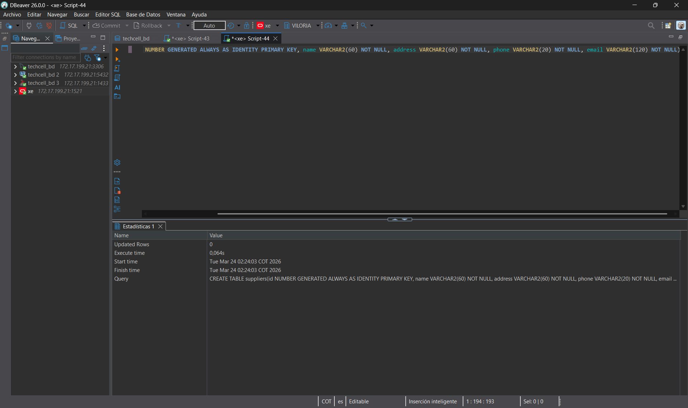

### 🔹 Creación de la tabla `products` en Oracle XE

En este paso creé la tabla `products` dentro del esquema `techcell`, adaptando los tipos de datos al estándar de Oracle.

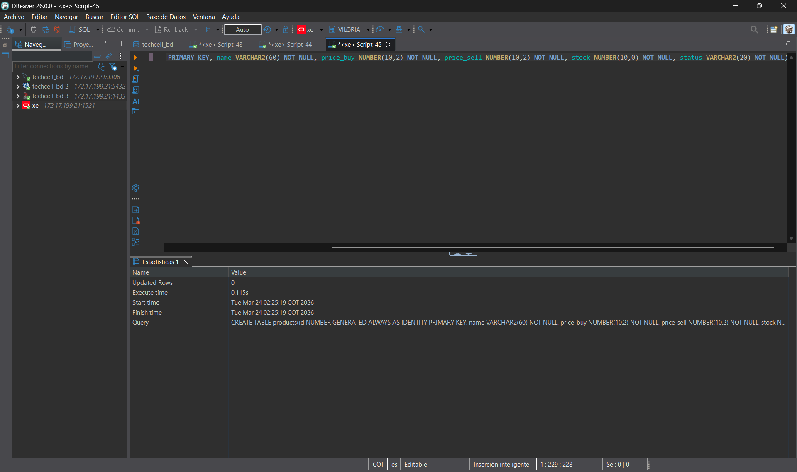

### 🔹 Creación de la tabla `equipment` en Oracle XE

En este paso creé la tabla `equipment` dentro del esquema `techcell`, adaptando los tipos de datos al estándar de Oracle.

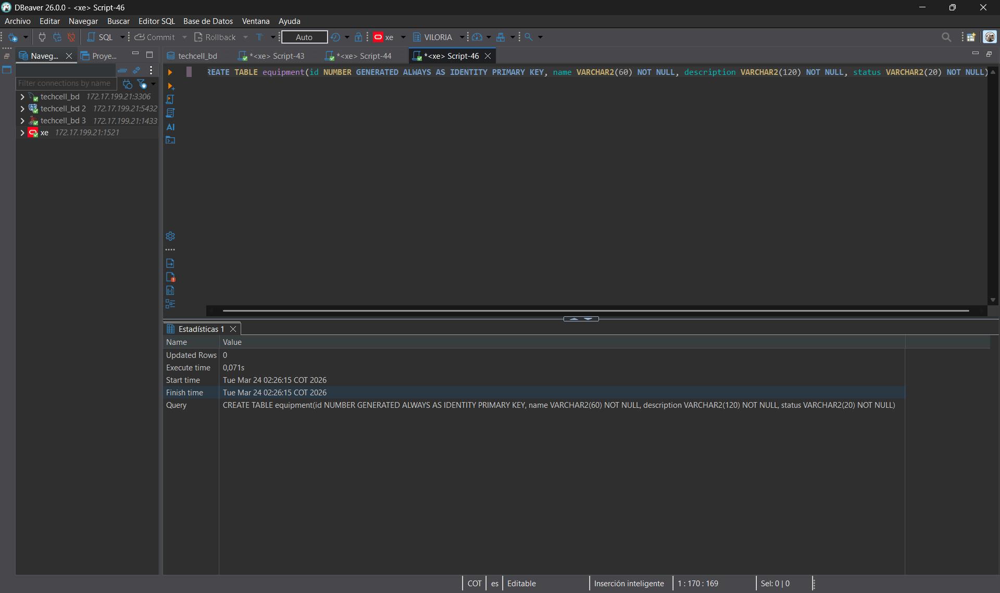

### 🔹 Creación de la tabla `spare_parts` en Oracle XE

En este paso creé la tabla `spare_parts` dentro del esquema `techcell`, adaptando los tipos de datos al estándar de Oracle.

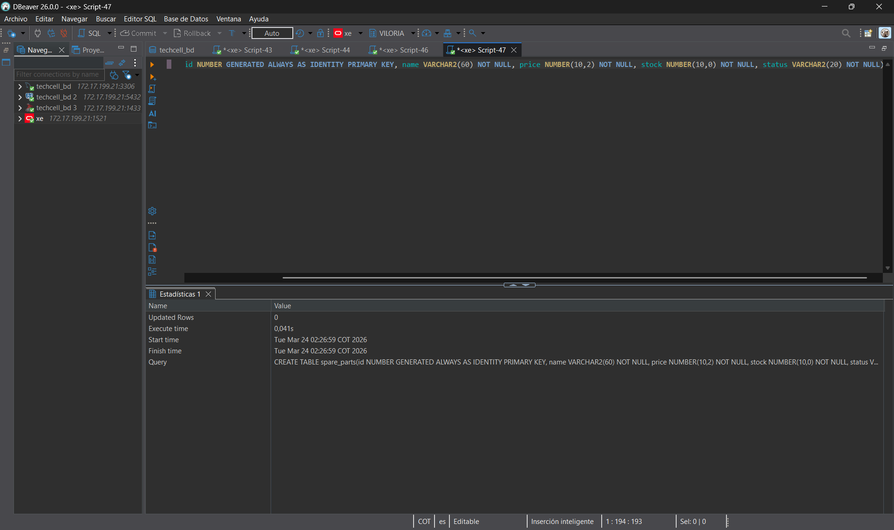

### 🔹 Creación de la tabla `sales` en Oracle XE

En este paso creé la tabla `sales` dentro del esquema `techcell`, adaptando los tipos de datos y la sintaxis al estándar de Oracle.

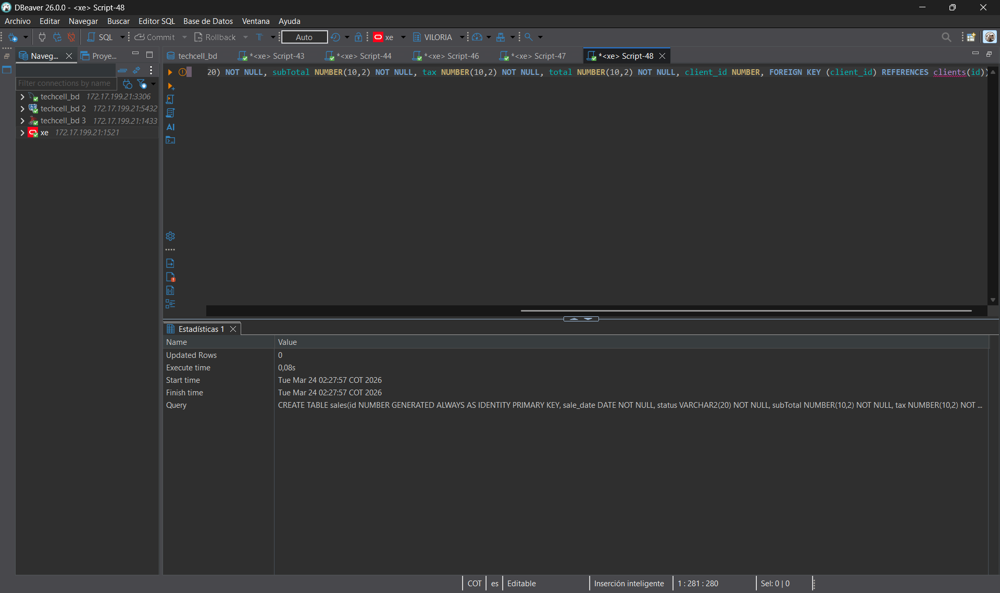

### 🔹 Creación de la tabla `service_orders` en Oracle XE

En este paso creé la tabla `service_orders` dentro del esquema `techcell`, adaptando los tipos de datos y la sintaxis al estándar de Oracle.

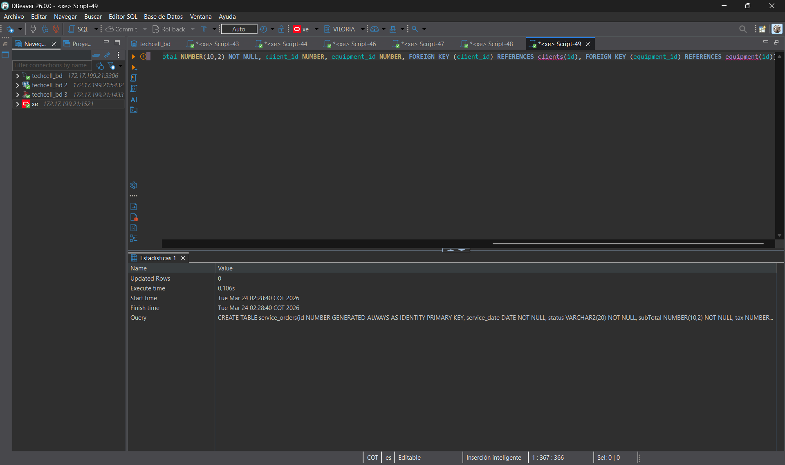

### 🔹 Creación de la tabla `service_orders` en Oracle XE

En este paso creé la tabla `service_orders` dentro del esquema `techcell`, adaptando los tipos de datos y la sintaxis al estándar de Oracle.

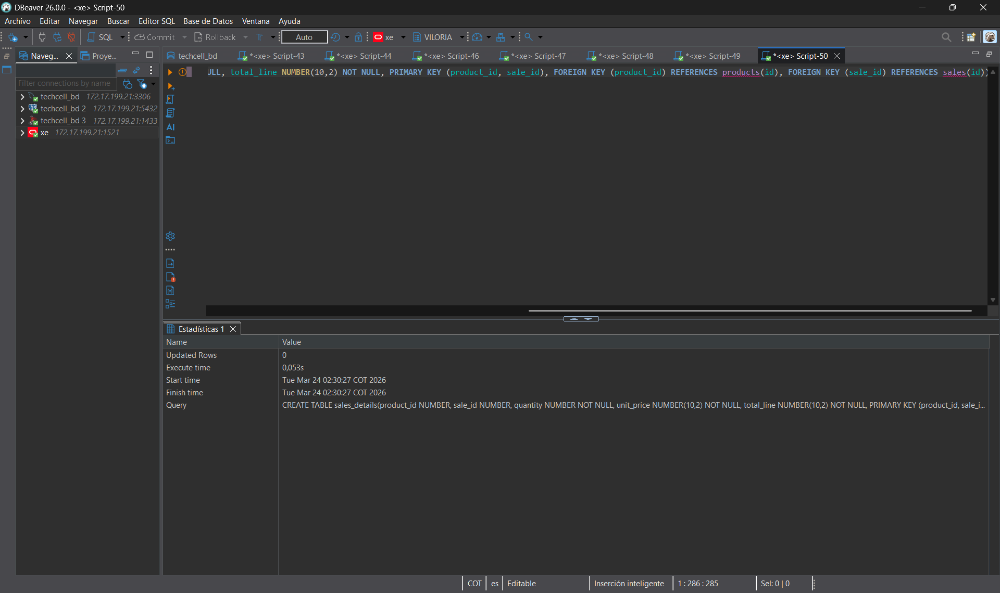

### 🔹 Creación de la tabla `products_suppliers` en Oracle XE

En este paso creé la tabla `products_suppliers` dentro del esquema `techcell`. Esta tabla intermedia permite gestionar la relación muchos-a-muchos entre productos y proveedores.

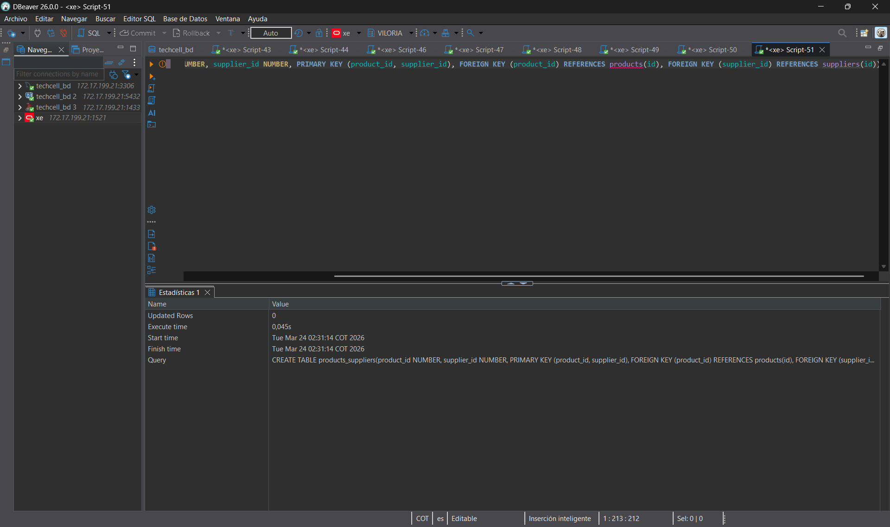

### 🔹 Creación de la tabla `service_parts` en Oracle XE

En este paso creé la tabla `service_parts` dentro del esquema `techcell`. Esta tabla intermedia permite gestionar la relación muchos-a-muchos entre las órdenes de servicio y los repuestos utilizados.

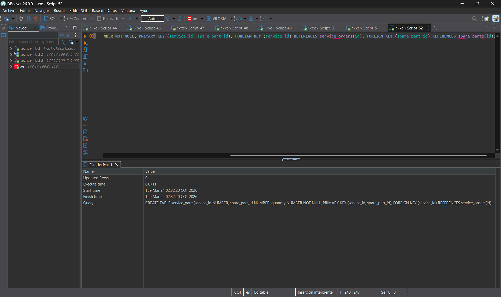

### 🔹 Creación de la tabla `warranties` en Oracle XE

En este paso creé la tabla `warranties` dentro del esquema `techcell`, adaptando los tipos de datos y la sintaxis al estándar de Oracle.

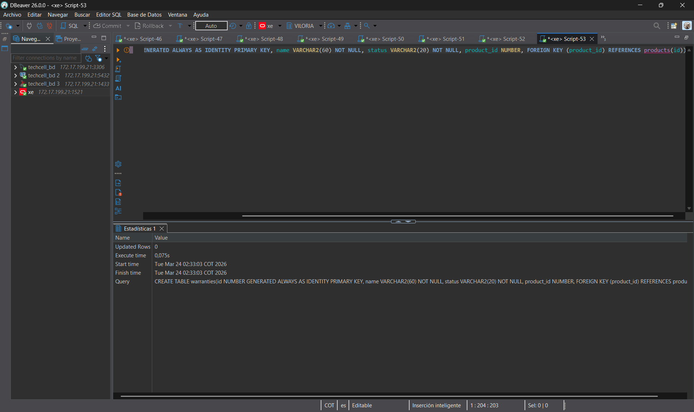

### 🔹 Creación de la tabla `users` en Oracle XE

En este paso creé la tabla `users` dentro del esquema `techcell`, adaptando los tipos de datos al estándar de Oracle.

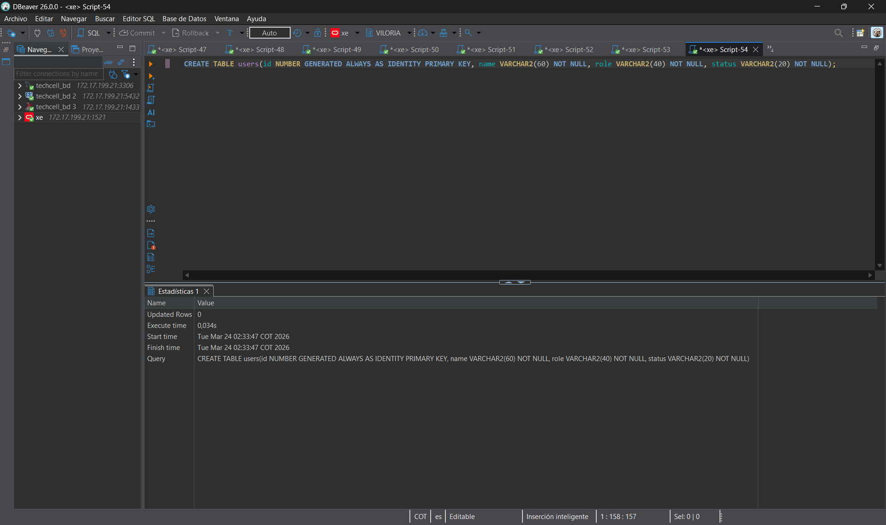
